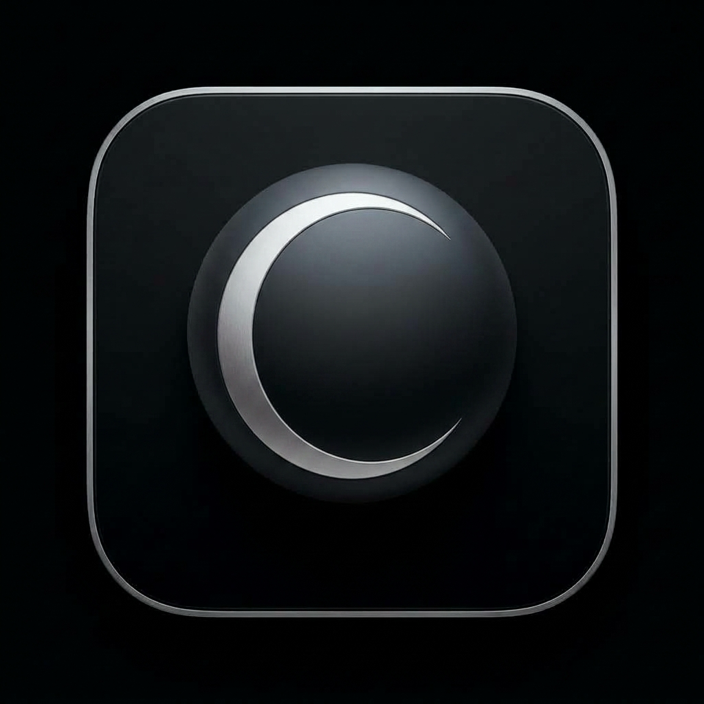

<p align="center">
  
</p>

<h1 align="center">Clio — Autonomous macOS Desktop Companion & Hands-Free Task Automator</h1>

<p align="center">
  
  
  
  
</p>

Clio is an autonomous macOS desktop companion and imitation-learning task automator. It observes user demonstrations (mouse clicks, keystrokes, gestures, dock activations, window movements), dissects them into declarative multi-step workflows, persists them in memory, and re-executes them hands-free using a virtual cursor overlay.

---

## 🌟 Features

- **Obsidian Floating HUD Bar**: Minimalist, monochromatic 58px floating spotlight interface (`⌥ Space` or `⌘ Space`). Never clutters the screen with intrusive drawer expansions.
- **Hands-Free Demonstration Recording**: Press **RECORD**, perform any actions (e.g. open apps, click dock icons, type inputs, click buttons), and press **● STOP & SAVE** to name the action.
- **4-Stage Dissection Pipeline**: Automatically normalizes screen coordinates, merges rapid typing/click events, attaches bundle IDs & window relative bounds, and synthesizes reproducible `WorkflowSpec` models.
- **Virtual Cursor Overlay (`VirtualCursor`)**: Animates an independent on-screen pointer showing exactly what step Clio is performing in real-time, with smooth quadratic bezier curves and state badges (`CLICKING`, `TYPING`, `APPROACHING`).
- **Strict Background Non-Bleed Execution**: Automated clicks and hotkeys are routed via native `kCGHIDEventTap` and Accessibility APIs without stealing focus or disrupting foreground user tasks.
- **Fast 4-Tier Semantic Retrieval & Intent Synthesizer**: Instant trigger matching, synonym aliases, FTS5 full-text search, and dynamic web/app intent synthesis (`open yt`, `open github`, `open chatgpt`, `open notes`, etc.).
- **Live SSE Telemetry Stream**: Real-time event broadcasting (`/api/stream`) for coordinates, action states, and conversational commentary.

---

## 📐 Architecture

```
┌────────────────────────────────────────────────────────┐
│            Obsidian HUD Bar (SwiftUI / AppKit)         │
│  - Command Input   - Voice Dictation   - Record Button  │
└──────────────────────────┬─────────────────────────────┘
                           │ HTTP / SSE (Port 8765)
┌──────────────────────────▼─────────────────────────────┐
│               Clio Core Engine (Python 3)               │
│                                                        │
│  1. Demonstration Capture & 4-Stage Pipeline           │
│     - Global Event Tap Monitor                         │
│     - Window Relative Coordinate Normalizer            │
│                                                        │
│  2. Persistent SQLite Memory (WAL Mode + FTS5)         │
│     - TaskMemoryEngine                                 │
│     - 4-Tier Natural Language Retrieval                │
│                                                        │
│  3. Executor & Intent Synthesizer                      │
│     - Dynamic Intent Parser (Apps, Web, Workflows)     │
│     - Multi-Step Resilient Execution Loop              │
│                                                        │
│  4. Actuation Layer                                    │
│     - VirtualCursor (Overlay Window & Smooth Bezier)   │
│     - Native macOS CGEvent Actuator (Background Mode)  │
└────────────────────────────────────────────────────────┘
```

---

## 🚀 Getting Started

### Prerequisites

- macOS Sonoma (14.0) or later
- Python 3.12+ (or Homebrew Python 3.14)
- Xcode Command Line Tools (`xcode-select --install`)
- Accessibility permissions enabled in **System Settings > Privacy & Security > Accessibility**

### Quick Build & Run

1. **Clone the repository**:
   ```bash
   git clone https://github.com/aaronnguyen26/clio.git
   cd clio
   ```

2. **Build the native App Bundle**:
   ```bash
   ./scripts/build_app.sh
   ```

3. **Start the Clio Backend Server**:
   ```bash
   python3 -m src.main --server --port 8765
   ```

4. **Launch Clio**:
   ```bash
   open Clio.app
   ```

---

---

## 🛠️ Usage & Controls

### ⌨️ How to Show & Toggle the Bar
You can summon or toggle Clio through any of the following methods:
- **Global Keyboard Shortcut**: Press `⌥ Space` (Option + Space) or `⌘ ⇧ Space` (Command + Shift + Space) anywhere on macOS.
- **Top Menu Bar Icon**: Click the `⌘ Clio` icon in the macOS status menu bar at the top right of your screen.
- **Desktop / Dock Shortcut**: Click `Clio.app` in your Dock or double-click `Toggle Clio.command` on your Desktop.
- **Terminal CLI Command**: Run `clio` or `clio show` from any terminal or script.

### 🚪 How to Close the Bar (User Commands)
The bar responds to standard user dismissal commands:
- **Automatic Close on Execution**: When you type a task (e.g. `open yt` or `open calendar`) and press `Enter`, the bar automatically slides away and closes so your screen is clear while Clio's virtual cursor executes the steps hands-free.
- **Direct Close Commands**: Type `close`, `hide`, `quit`, `exit`, `dismiss`, or `esc` into the bar and press `Enter`.
- **Keyboard Dismissal**: Press `Esc` or `⌘ W`.
- **Close Button**: Click the `✕` button on the right side of the bar.
- **CLI Close**: Run `clio hide` or `clio close`.
- **Toggle Off**: Press `⌥ Space` or click the menu bar `⌘ Clio` icon again.

### 🎬 Recording a New Action
1. Open Clio Bar (`⌥ Space` or click `⌘ Clio`).
2. Click **RECORD**.
3. Perform the task on your Mac (e.g. click a Dock item, open an app, navigate to a URL).
4. Click **● STOP & SAVE** on the bar.
5. Enter a friendly name and trigger phrase (e.g., `open yt`), then click **Save & Add**.

### ⚡ Running an Action
1. Summon the bar (`⌥ Space` or `clio`).
2. Type your trigger (e.g., `open yt` or `open calendar`) and press `Enter`.
3. The bar immediately closes and Clio's virtual cursor navigates to the target, focuses the app, and performs the demonstrated sequence hands-free!

---

## 🧪 Testing

Comprehensive test suites verify multi-step demonstration recording, intent synthesis, retrieval, and virtual cursor non-bleed execution:

```bash
# Run unit & integration test suites
python3 run_tests.py

# Run full test suite with coverage
python3 -m pytest tests/ -v
```

---

## 📄 License

MIT License. Designed and built with ❤️ on macOS.
