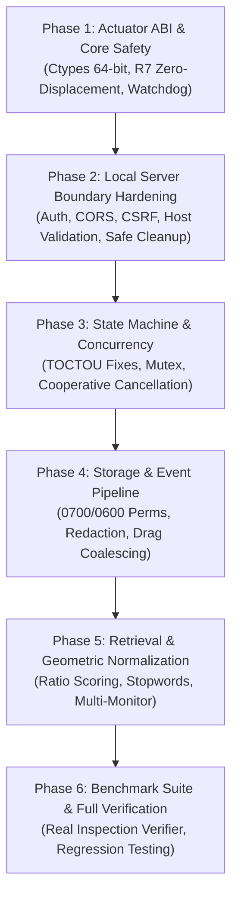

# Master Architecture Remediation Plan: Clio Desktop Companion

> **Document Status:** Complete Proposal — Awaiting User Approval to Execute  
> **Source Analysis:** [`AUDIT_REPORT.md`](file:///Users/minhnguyen/Desktop/Coding/imitate/AUDIT_REPORT.md) (38 Findings: 2 Critical, 10 High, 26 Medium)  
> **Target Subsystems:** `src/actuators/`, `src/server/`, `src/executor/`, `src/memory/`, `src/companion/`, `src/benchmark/`  
> **Execution Invariant:** Zero disruption to host machine (zero hardware mouse displacement, background-isolated app launching, non-destructive test execution).

---

## 1. Executive Strategy & Phased Roadmap

To remediate all 38 identified vulnerabilities without introducing regressions or disrupting ongoing operations, the remediation is structured into **6 sequential, dependency-ordered phases**:



### Risk & Priority Calibration
| Phase | Focus Domain | Target Vulnerabilities | Priority | Primary Risk Mitigated |
|---|---|---|---|---|
| **Phase 1** | OS Actuators & IPC | `VULN-ACT-01..10` | **CRITICAL** | Interpreter SIGSEGV, hardware mouse displacement, failsafe bypass |
| **Phase 2** | Local HTTP/SSE Server | `VULN-SRV-01..06`, `MED-CONC-01` | **CRITICAL** | Remote web execution (RCE), CSRF, DNS rebinding, secret leakage |
| **Phase 3** | Concurrency & State Machine | `CRIT-RACE-01..02`, `HIGH-CONC-01..02`, `HIGH-LOGIC-02..03` | **HIGH** | Simultaneous execution collisions, zombie background clicking |
| **Phase 4** | Storage & Capture Pipeline | `SEC-VULN-01..02`, `CONC-FLAW-01..02`, `CRIT-LOGIC-01`, `HIGH-LOGIC-01` | **HIGH** | Plaintext credential leaks, drag loss, database desync |
| **Phase 5** | Retrieval & Geometry | `RETR-FLAW-01..02`, `COORD-FLAW-01..02`, `PARAM-FLAW-01`, `VULN-COMP-01` | **MEDIUM** | Inescapable clarification loops, multi-monitor crashes, slot loss |
| **Phase 6** | Benchmark & End-to-End | `VULN-BM-01..02`, full regression | **MEDIUM** | Facade test self-certification, live macOS verification |

---

## 2. Detailed Phase Specifications

---

### Phase 1: Core OS Actuators & Low-Level Safety (ABI Stability)
**Goal:** Guarantee complete memory safety at the Darwin ARM64/ctypes boundary, strictly enforce Requirement R7 (zero hardware mouse displacement), and repair the 50Hz emergency failsafe watchdog.

#### 1.1 Ctypes 64-bit Function Prototypes (`VULN-ACT-01`)
* **Target File:** [`src/actuators/virtual_cursor.py`](file:///Users/minhnguyen/Desktop/Coding/imitate/src/actuators/virtual_cursor.py)
* **Action Items:**
  1. Define explicit `argtypes` and `restype` across all CoreGraphics ctypes functions:
     * `CGEventCreate`: `argtypes = [c_void_p]`, `restype = c_void_p`
     * `CGEventGetLocation`: `argtypes = [c_void_p]`, `restype = CGPoint`
     * `CGEventPost`: `argtypes = [c_uint32, c_void_p]`, `restype = None`
     * `CGEventPostToPid`: `argtypes = [c_int32, c_void_p]`, `restype = None`
     * `CFRelease`: `argtypes = [c_void_p]`, `restype = None`
  2. Eliminate 32-bit truncation of pointers on Darwin ARM64.

#### 1.2 Strict Enforcement of Requirement R7 (`VULN-ACT-02`)
* **Target File:** [`src/actuators/virtual_cursor.py`](file:///Users/minhnguyen/Desktop/Coding/imitate/src/actuators/virtual_cursor.py)
* **Action Items:**
  1. Completely remove `CGWarpMouseCursorPosition` and `CGEventPost(kCGHIDEventTap, ...)` from `_fallback_global_dispatch()`.
  2. Implement strict process-targeted event routing: if `target_pid` is unresolved, resolve the frontmost application PID or raise `InputSynthesisError` rather than warping the user's hardware pointer.
  3. Ensure static AST assertions (`test_no_cgwarp_in_module`) pass cleanly.

#### 1.3 Emergency Failsafe Watchdog Restoration (`VULN-ACT-03`, `VULN-ACT-07`)
* **Target Files:** [`src/actuators/failsafe.py`](file:///Users/minhnguyen/Desktop/Coding/imitate/src/actuators/failsafe.py), [`src/actuators/macos.py`](file:///Users/minhnguyen/Desktop/Coding/imitate/src/actuators/macos.py)
* **Action Items:**
  1. Remove the arbitrary suppression of `(0, 0)` in `failsafe.py:110-114` and `check_corner()` (lines 295-298).
  2. Implement proper macOS CoreGraphics `CGEventGetLocation` bindings to fetch real mouse coordinates accurately without returning dummy `(500, 500)` positions.
  3. Support multi-monitor bounding boxes: calculate the union of all active display bounds (`CGGetActiveDisplayList`) so physical corners on secondary monitors (negative X or Y coordinates) trigger the failsafe.

#### 1.4 URL Protocol Whitelist & Shell Sanitation (`VULN-ACT-04`, `VULN-ACT-09`, `VULN-ACT-10`)
* **Target Files:** [`src/actuators/macos.py`](file:///Users/minhnguyen/Desktop/Coding/imitate/src/actuators/macos.py), [`src/actuators/virtual_cursor.py`](file:///Users/minhnguyen/Desktop/Coding/imitate/src/actuators/virtual_cursor.py)
* **Action Items:**
  1. In `MacOSActuator.open_url()`, restrict schemes strictly to `http://` and `https://`. Reject `file://`, `javascript:`, and raw paths to prevent arbitrary binary execution.
  2. In `VirtualCursor`, replace `osascript` and `pgrep` shell subprocesses with native `NSWorkspace` ctypes calls for PID resolution (`runningApplicationsWithBundleIdentifier:`).
  3. Remove default fallback clicks directed to macOS `Finder.app`.

* **Phase 1 Verification:**
  * Run `pytest tests/unit/test_failsafe.py tests/unit/test_virtual_cursor.py tests/unit/test_actuators_macos.py`.
  * Verify `AST` scan confirms zero occurrences of `CGWarpMouseCursorPosition`.

---

### Phase 2: Local HTTP & SSE Server Hardening (Network Boundary)
**Goal:** Eliminate Remote Code Execution (RCE), CSRF, DNS rebinding, and sensitive telemetry leaks on `127.0.0.1:8765`.

#### 2.1 Bearer Token Authentication & Session Security (`VULN-SRV-01`)
* **Target File:** [`src/server/server.py`](file:///Users/minhnguyen/Desktop/Coding/imitate/src/server/server.py)
* **Action Items:**
  1. Generate an ephemeral high-entropy auth token (`secrets.token_urlsafe(32)`) on server startup stored in memory and written to a restricted local file (`~/.task_automator/auth_token` with mode `0600`).
  2. Implement an authentication check in `_Handler`: require `Authorization: Bearer <token>` or `X-Clio-Token: <token>` for all endpoints (except local static asset serving for the HUD itself when accessed from same-origin).
  3. Provide CLI and Swift HUD integration to pass the token seamlessly.

#### 2.2 Strict CORS Origin & Host Header Whitelist (`VULN-SRV-02`, `VULN-SRV-04`)
* **Target File:** [`src/server/server.py`](file:///Users/minhnguyen/Desktop/Coding/imitate/src/server/server.py)
* **Action Items:**
  1. Replace `Access-Control-Allow-Origin: *` with strict origin verification:
     * Only allow origins matching `http://127.0.0.1:8765`, `http://localhost:8765`, or native app schemes.
     * Reject all third-party web origins.
  2. Enforce `Host` header validation: verify that `Host` strictly matches `127.0.0.1:8765` or `localhost:8765`. Reject foreign or rebinding domains with `HTTP 400 Bad Request`.

#### 2.3 Anti-CSRF Token Enforcement (`VULN-SRV-03`)
* **Target File:** [`src/server/server.py`](file:///Users/minhnguyen/Desktop/Coding/imitate/src/server/server.py)
* **Action Items:**
  1. Require a custom header `X-Requested-With: ClioHUD` or `X-Clio-Token` on all state-modifying requests (`POST`, `DELETE`, `PUT`).
  2. Browser preflight mechanisms block standard cross-origin forms from attaching custom headers, eliminating browser-based CSRF.

#### 2.4 SSE Stream Protection & Queue Throttling (`VULN-SRV-05`, `MED-CONC-01`)
* **Target File:** [`src/server/server.py`](file:///Users/minhnguyen/Desktop/Coding/imitate/src/server/server.py)
* **Action Items:**
  1. Protect `GET /api/stream` with auth token validation.
  2. Increase client queue buffer (`maxsize=500`) and replace abrupt disconnection on `queue.Full` with circular buffer drop-oldest behavior:
     ```python
     try:
         client_queue.put_nowait(event_data)
     except queue.Full:
         try:
             client_queue.get_nowait()
             client_queue.put_nowait(event_data)
         except Exception:
             pass
     ```

#### 2.5 Safe Port Rebinding & Signal Management (`VULN-SRV-06`, `VULN-ACT-08`)
* **Target File:** [`src/server/server.py`](file:///Users/minhnguyen/Desktop/Coding/imitate/src/server/server.py)
* **Action Items:**
  1. Remove `shell=True` from `_clear_stale_port()`. Use structured `subprocess.run(["lsof", "-ti", f":{port}"], ...)` with integer conversion `int(self.port)`.
  2. Verify process ownership before sending signals; send graceful `SIGTERM` first, waiting up to 1s before `SIGKILL`.
  3. In `server.stop()`, cancel all active execution threads via cancellation tokens before shutting down sockets.

* **Phase 2 Verification:**
  * Run `pytest tests/unit/test_server.py`.
  * Execute test matrix validating that requests without auth return `401 Unauthorized`, foreign `Host` headers return `400 Bad Request`, and foreign CORS origins are rejected.

---

### Phase 3: Concurrency, Runtime State Machine & Worker Safety
**Goal:** Eliminate race conditions between HTTP handlers, workflow execution, demonstration capture, and background actuation threads.

#### 3.1 TOCTOU Double-Execution Prevention (`CRIT-RACE-01`)
* **Target File:** [`src/server/server.py`](file:///Users/minhnguyen/Desktop/Coding/imitate/src/server/server.py)
* **Action Items:**
  1. Hold `self._lock` atomically across the entire validation, retrieval, and worker thread spawn sequence in `execute_workflow_async()`.
  2. Ensure `self._is_executing` cannot be flipped by another thread during retrieval resolution:
     ```python
     with self._lock:
         if self._is_executing:
             return {"success": False, "error": "A workflow is already in progress."}
         if self.demonstration_capture.is_recording:
             return {"success": False, "error": "Cannot execute while demonstration recording is active."}
         self._is_executing = True
     ```

#### 3.2 Mutual Exclusion for Demonstration Capture vs. Execution (`CRIT-RACE-02`)
* **Target Files:** [`src/server/server.py`](file:///Users/minhnguyen/Desktop/Coding/imitate/src/server/server.py), [`src/memory/capture.py`](file:///Users/minhnguyen/Desktop/Coding/imitate/src/memory/capture.py)
* **Action Items:**
  1. Check `self._is_executing` inside `ClioServer.start_recording()`, returning error if an automated task is running.
  2. Tag synthetic actuator events with `synthetic=True` so that even if both are active, `LiveDemonstrationCapture` ignores synthetic events, preventing recursive feedback loops.

#### 3.3 Cooperative Cancellation Tokens & Zombie Thread Elimination (`HIGH-CONC-01`, `HIGH-LOGIC-03`)
* **Target Files:** [`src/executor/executor.py`](file:///Users/minhnguyen/Desktop/Coding/imitate/src/executor/executor.py), [`src/actuators/virtual_cursor.py`](file:///Users/minhnguyen/Desktop/Coding/imitate/src/actuators/virtual_cursor.py), [`src/server/server.py`](file:///Users/minhnguyen/Desktop/Coding/imitate/src/server/server.py)
* **Action Items:**
  1. Introduce `threading.Event()` as a cooperative cancellation token passed into `AutonomousWorkflowExecutor.execute()`.
  2. In `VirtualCursor.type_text()` and step loops, check `cancellation_token.is_set()` before each character or action:
     ```python
     for char in text:
         if cancel_event and cancel_event.is_set():
             raise ExecutionAbortedError("Execution cancelled by user.")
         # dispatch keystroke...
     ```
  3. Ensure `server.cancel_execution()` triggers the event and waits with a 1.0s timeout for the worker thread to exit cleanly.

#### 3.4 Bounded Event Listener Thread Pool (`HIGH-CONC-02`, `VULN-ACT-06`)
* **Target File:** [`src/actuators/virtual_cursor.py`](file:///Users/minhnguyen/Desktop/Coding/imitate/src/actuators/virtual_cursor.py)
* **Action Items:**
  1. Replace unthrottled `threading.Thread(target=_dispatch).start()` in `_record_event()` with a single dedicated background worker consuming from a thread-safe `queue.Queue`.
  2. Eliminates thread storms (40Hz spikes) and guarantees chronological ordering of telemetry events.

#### 3.5 Target PID Drift Resolution (`HIGH-LOGIC-02`)
* **Target Files:** [`src/actuators/virtual_cursor.py`](file:///Users/minhnguyen/Desktop/Coding/imitate/src/actuators/virtual_cursor.py), [`src/executor/executor.py`](file:///Users/minhnguyen/Desktop/Coding/imitate/src/executor/executor.py)
* **Action Items:**
  1. In multi-step workflows, invalidate or re-resolve `target_pid` whenever an action targets a new application bundle or window.
  2. Provide explicit `target_bundle` per step to prevent keystrokes intended for App B from bleeding into App A.

* **Phase 3 Verification:**
  * Run `pytest tests/unit/test_executor.py tests/unit/test_events.py`.
  * Run concurrent execution stress tests verifying that simultaneous trigger attempts cleanly reject the second request.

---

### Phase 4: Storage Hardening, Transaction Integrity & Event Coalescing
**Goal:** Enforce filesystem security boundaries, protect sensitive credentials at rest, achieve atomic database commits, and preserve drag gestures and modifier keys.

#### 4.1 POSIX Directory & File Permissions (`SEC-VULN-01`)
* **Target File:** [`src/memory/engine.py`](file:///Users/minhnguyen/Desktop/Coding/imitate/src/memory/engine.py)
* **Action Items:**
  1. When creating `~/.task_automator/`, enforce mode `0o700` (`drwx------`).
  2. Before creating `task_memory.db`, open with `os.open(path, os.O_CREAT | os.O_RDWR, 0o600)` to ensure files are `-rw-------`.
  3. Apply `os.chmod(path, 0o600)` to existing databases and WAL files during engine initialization.

#### 4.2 Sensitive Keystroke & Password Redaction (`SEC-VULN-02`)
* **Target Files:** [`src/memory/recorder.py`](file:///Users/minhnguyen/Desktop/Coding/imitate/src/memory/recorder.py), [`src/memory/engine.py`](file:///Users/minhnguyen/Desktop/Coding/imitate/src/memory/engine.py)
* **Action Items:**
  1. Add regex-based credential scrubbers in `WorkflowRecorderPipeline` matching API keys (e.g. `sk-...`, `ghp_...`), JWT tokens, password patterns, and high-entropy secrets.
  2. Replace detected secrets with `${SENSITIVE_PARAM}` variable placeholders before committing to SQLite.

#### 4.3 Atomic Versioning Transactions (`CONC-FLAW-01`, `CONC-FLAW-02`)
* **Target File:** [`src/memory/engine.py`](file:///Users/minhnguyen/Desktop/Coding/imitate/src/memory/engine.py)
* **Action Items:**
  1. In `save_workflow()`, combine `UPDATE workflows` and `INSERT INTO workflow_versions` into a single atomic transaction block (`BEGIN IMMEDIATE` ... `COMMIT`).
  2. Maintain a connection pool or thread-local connections for concurrent worker threads, avoiding single-connection serialization while keeping `busy_timeout=30000`.

#### 4.4 Preservation of Mouse Drag Gestures (`CRIT-LOGIC-01`)
* **Target Files:** [`src/memory/capture.py`](file:///Users/minhnguyen/Desktop/Coding/imitate/src/memory/capture.py), [`src/memory/recorder.py`](file:///Users/minhnguyen/Desktop/Coding/imitate/src/memory/recorder.py)
* **Action Items:**
  1. Include `kCGEventLeftMouseDragged` in the `CGEventTap` event mask in `capture.py`.
  2. In `EventCoalescingStage.coalesce()` in `recorder.py`, calculate Euclidean distance between `mouse_down` and `mouse_up`:
     * If distance $> 8.0$ pixels, emit `ActionType.DRAG` with start and end coordinates.
     * Otherwise, emit `ActionType.CLICK`.

#### 4.5 Shift Modifier Preservation on Navigation Hotkeys (`HIGH-LOGIC-01`)
* **Target File:** [`src/memory/recorder.py`](file:///Users/minhnguyen/Desktop/Coding/imitate/src/memory/recorder.py)
* **Action Items:**
  1. Include `"shift"` in `has_cmd_ctrl` check in `recorder.py:301` when paired with non-alphanumeric keys (`Tab`, `Return`, `Arrows`, `Escape`).
  2. Ensure `Shift+Tab` emits `payload={"keys": ["shift", "tab"]}` rather than stripping the `Shift` key.

* **Phase 4 Verification:**
  * Run `pytest tests/unit/test_recorder.py tests/unit/test_memory_engine.py tests/unit/test_demonstration_capture.py`.
  * Validate permissions on generated test databases (`0700`/`0600`).
  * Verify drag-and-drop test cases emit `ActionType.DRAG`.

---

### Phase 5: Retrieval, Coordinate Geometry & Companion State
**Goal:** Eliminate substring retrieval clustering, support multi-monitor negative coordinates, prioritize normalized ratios, and synchronize dialogue confirmation states.

#### 5.1 Correct Substring Ratio Scoring & Conversational Stopwords (`RETR-FLAW-01`, `RETR-FLAW-02`)
* **Target File:** [`src/memory/retrieval.py`](file:///Users/minhnguyen/Desktop/Coding/imitate/src/memory/retrieval.py)
* **Action Items:**
  1. In `_match_tier3_substring_and_fts()`, invert the ratio calculation so that longer utterances matching short keywords receive lower confidence, differentiating exact matches from partial mentions:
     ```python
     length_disparity = len(canonical) / len(norm_utterance)
     score = round(0.80 + 0.15 * length_disparity, 3)
     ```
  2. Add a conversational stopword filter in Tier 4 Jaccard scoring (`could`, `you`, `please`, `kindly`, `help`, `me`, `to`, `the`, `a`, `can`, `i`, `want`), preventing score dilution when users speak naturally.

#### 5.2 Multi-Monitor Negative Coordinates & Resolution Independence (`COORD-FLAW-01`, `COORD-FLAW-02`)
* **Target Files:** [`src/memory/models.py`](file:///Users/minhnguyen/Desktop/Coding/imitate/src/memory/models.py), [`src/executor/executor.py`](file:///Users/minhnguyen/Desktop/Coding/imitate/src/executor/executor.py), [`src/memory/capture.py`](file:///Users/minhnguyen/Desktop/Coding/imitate/src/memory/capture.py)
* **Action Items:**
  1. In `TargetCoordinates.validate()`, remove `self.abs_x < 0` checks for absolute screen coordinates, allowing valid negative offsets on multi-monitor configurations.
  2. In `executor.py`, prioritize `norm_x`/`norm_y` over static `screen_x`/`screen_y` pixel coordinates so that workflows adapt when application windows are resized or moved across displays.
  3. Ensure `LiveDemonstrationCapture` captures target window bounds during mouse clicks to compute relative normalized coordinates.

#### 5.3 Dynamic Parameter Slot Extraction (`PARAM-FLAW-01`)
* **Target Files:** [`src/memory/parameters.py`](file:///Users/minhnguyen/Desktop/Coding/imitate/src/memory/parameters.py), [`src/companion/session.py`](file:///Users/minhnguyen/Desktop/Coding/imitate/src/companion/session.py)
* **Action Items:**
  1. In `CompanionSession`, parse user utterances for named parameter slots (`titled <Title>`, `named <Name>`, `to <Recipient>`) before dispatching to execution.
  2. In `ParameterEngine.interpolate()`, raise a warning or prompt for missing parameters instead of typing literal `${token}` strings.

#### 5.4 Companion Dialogue State Synchronization (`VULN-COMP-01`)
* **Target Files:** [`src/companion/dialogue.py`](file:///Users/minhnguyen/Desktop/Coding/imitate/src/companion/dialogue.py), [`src/companion/commentary.py`](file:///Users/minhnguyen/Desktop/Coding/imitate/src/companion/commentary.py)
* **Action Items:**
  1. In `DialogueEngine.respond()`, set `self.state = DialogueState.CONFIRMING` and store `self.pending_workflow = top_match` on the low-confidence branch so user affirmations ("yes") execute the workflow properly.
  2. In `commentary.py`, copy listeners or use thread locks during event iteration (`with self._lock: listeners = list(self._listeners)`).

* **Phase 5 Verification:**
  * Run `pytest tests/unit/test_retrieval.py tests/unit/test_coordinates.py tests/unit/test_parameters.py tests/unit/test_companion.py`.
  * Validate polite natural language queries score $>0.75$ and trigger without failure.

---

### Phase 6: Benchmark Suite Hardening & Full Regression Verification
**Goal:** Eliminate facade mock checks in the benchmark verifier, support real verification on live macOS environments, and validate full multi-domain autonomy.

#### 6.1 Real Inspection Verifiers (`VULN-BM-01`)
* **Target File:** [`src/benchmark/verifier.py`](file:///Users/minhnguyen/Desktop/Coding/imitate/src/benchmark/verifier.py)
* **Action Items:**
  1. Replace blind `isinstance(actuator, MockActuator)` checks with inspection routines that query system state on live macOS systems:
     * Notes: Query AppleScript/Notes database or inspect active window titles.
     * Web: Query browser window title or URL.
  2. In `verify_r6_background_invariants`, inspect mock actuator history to verify that background flags were actually passed (e.g. `open -g`) rather than returning unconditional `True`.

#### 6.2 Autonomous Web Research Dynamic Flow (`VULN-BM-02`)
* **Target File:** [`src/benchmark/scenarios.py`](file:///Users/minhnguyen/Desktop/Coding/imitate/src/benchmark/scenarios.py)
* **Action Items:**
  1. Replace the hardcoded static summary string in `build_cross_domain_workflow()` with actual dynamic parameters or clipboard-based extraction step (`Cmd+A`, `Cmd+C`).

#### 6.3 Comprehensive Regression Suite & Architectural Invariant Tests
* **Target Files:** Entire test suite (`tests/unit/`, `tests/integration/`)
* **Action Items:**
  1. Run full test suite: `python3 -m pytest tests/unit/ tests/integration/`.
  2. Execute standalone architectural test matrix verifying that all 38 findings from [`AUDIT_REPORT.md`](file:///Users/minhnguyen/Desktop/Coding/imitate/AUDIT_REPORT.md) are fully resolved.
  3. Verify `git status` to ensure all changes are clean, formatted, and documented.

---

## 3. Rollback & Contingency Plan

If any regression occurs during execution:
1. **Git Isolation:** Each phase will be executed on a dedicated topic branch or committed atomically with clear commit messages referencing the vulnerability IDs (e.g. `fix(actuators): resolve 64-bit ctypes prototypes and R7 displacement (VULN-ACT-01, VULN-ACT-02)`).
2. **Reversion:** Any individual phase can be cleanly reverted using `git revert` without breaking unrelated subsystems.
3. **Safety Fallback:** If any actuator change impacts mouse movement, tests immediately halt via failsafe.

---

## 4. Acceptance Gates

Before execution begins, please confirm:
- [ ] Approval of the 6-phase order and priorities.
- [ ] Approval of Bearer Token authentication design for local HTTP server.
- [ ] Acceptance to proceed with Phase 1 (Actuators & ABI Stability).
