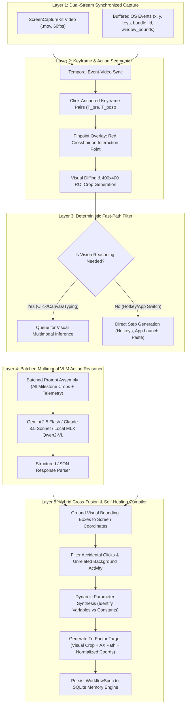

# Multimodal AI Workflow Dissection Architecture

> **Specification & Architectural Blueprint**  
> **Status:** Proposed / Architectural Design  
> **Target Subsystem:** Teach-Mode Dissection Engine (`src/memory/capture.py`, `src/memory/recorder.py`, `src/ai/dissector.py`)  
> **Objective:** Transition Clio from rule-based OS event coalescing to a hybrid Vision-Language Model (VLM) + Hardware OS-Telemetry dissection engine capable of transforming raw screen recordings and human demonstrations into robust, declarative, and self-healing multi-step workflows.

---

## 1. Executive Summary & Problem Statement

### 1.1 The Limitations of Purely Heuristic Event Dissection
In a pure non-AI capture architecture, demonstration dissection relies on:
1. **Coordinate-based OS events** (`CGEventTap` / `NSEvent.addGlobalMonitorForEvents`).
2. **Accessibility tree queries** (`AXUIElementCopyElementAtPosition`).
3. **Heuristic rules** (e.g., double-click clustering, pause clamping, drag thresholds).

While deterministic and lightweight, heuristic dissection suffers from distinct real-world failure modes:
- **Canvas and Electron Black Boxes:** Modern desktop and web apps (Figma, Notion, VS Code, Google Docs, Slack, Chrome WebGL) render UI elements to canvas or custom WebViews where accessibility trees (`AXUIElement`) often return generic containers (`AXGroup` or `AXWebArea`) with no descriptive titles, roles, or stable identifiers.
- **Accidental Actions & Jitter:** Humans frequently hesitate, misclick, scroll past targets and scroll back, switch windows accidentally, or make corrective keystrokes. Heuristics struggle to distinguish functional intent from human hesitation.
- **Visual State Blindness:** An OS event stream knows that mouse button 1 was pressed at coordinate `(420, 280)`, but it does not know if that click opened a dropdown menu, triggered a loading spinner, submitted a form, or failed due to a validation error.
- **Fragility Across Resolutions:** Pure coordinate steps (`abs_x`, `abs_y`) break when executed on external monitors, different display scalings, or resized windows.

### 1.2 The AI-Powered Vision: Hardware Telemetry + Visual Context Fusion
The core architectural insight is that **neither pure pixels nor pure OS event logs are sufficient on their own**:
- If an AI is given **only two screenshots** (Before and After), it cannot know *what gesture* caused the transition (single click, right click, double click, Enter key, or an automatic timer/notification).
- If the OS is given **only hardware event coordinates**, it cannot know *what UI element* was under the cursor or *if the action actually succeeded*.

By binding **exact physical hardware telemetry from macOS** with **focused visual crops analyzed by a Multimodal Vision-Language Model (VLM)**, Clio achieves semantic action understanding. The OS provides the physical ground truth; the AI provides visual comprehension, intent classification, and self-healing verification.

---

## 2. High-Level System Architecture & Data Flow

The AI Dissection System operates as a 5-layer pipeline that runs asynchronously upon completion of a screen recording:



---

## 3. The 6-Step Dissection Methodology: Bridging Before & After

### Step 1: Temporal Keyframe Extraction & Cursor Crosshair Pinpointing
When the user clicks **Stop & Save**, the video container is finalized and the client event buffer is delivered. The system extracts milestone keyframes anchored around each user interaction:
- **Pre-Action Frame ($T_{pre}$):** Captured $150\,\text{ms}$ prior to the mouse click or hotkey. Captures the UI in its resting, interactive state.
- **Action Frame ($T_{action}$):** Captured at the exact millisecond of `mouse_down` or `key_down`.
- **Post-Action Frame ($T_{post}$):** Captured $350\,\text{ms} - 500\,\text{ms}$ after `mouse_up` or `key_up`. Captures the immediate visual consequence (dialog appearance, button depression, menu popover, navigation).
- **Red Crosshair Overlay:** On $T_{pre}$, the system renders a high-visibility, semi-transparent red crosshair target centered at the exact click coordinate $(x, y)$. This eliminates AI ambiguity regarding where the user's attention was directed.
- **Region-of-Interest (ROI) Cropping:** Rather than dispatching 4K desktop frames, the system crops a $400 \times 400$ pixel square centered around $(x, y)$, alongside a single downsampled full-screen thumbnail ($1024 \times 576$) for global spatial reference.

### Step 2: Physical Telemetry Hand-off (Gesture Certainty)
The OS passes the physical action facts to the model so the AI never guesses the gesture:

| User Action | OS Telemetry Delivered | Visual Evidence Analyzed by VLM | Synthesized Semantic Output |
| :--- | :--- | :--- | :--- |
| **Single Click** | `left_click`, `(x, y)`, `Safari` | Pre: Button labeled "Checkout"<br/>Post: Modal dialog opens | *"Click the 'Checkout' button to initiate payment"* |
| **Double Click** | `double_click`, `(x, y)`, `Finder` | Pre: Folder icon "Projects"<br/>Post: New Finder window opens | *"Double-click the 'Projects' folder to open it"* |
| **Right Click** | `right_click`, `(x, y)`, `VS Code` | Pre: Code editor canvas<br/>Post: Context menu expands | *"Right-click editor to open context menu"* |
| **Drag & Drop** | `drag`, `start=(x1, y1)`, `end=(x2, y2)` | Pre: File icon at $S$<br/>Post: File deposited into folder at $E$ | *"Drag 'receipt.pdf' into the 'Archive' folder"* |
| **Text Typing** | `type_text`, `raw_keys="helo\b\blo"` | Pre: Empty text box<br/>Post: Text field contains "hello" | *"Enter 'hello' into the search input"* |
| **Hotkey** | `hotkey`, `["Cmd", "S"]` | Pre: Dirty editor indicator (●)<br/>Post: Clean indicator, file saved | *"Save changes using Cmd+S shortcut"* |

### Step 3: Causal Verification & Background Noise Elimination
Modern desktops have constant background activity (ads refreshing, system clock updating, Slack notifications appearing).
- **Local Spatial Bounding:** The $400 \times 400$ ROI crop physically isolates the action zone, preventing background activity outside the interaction zone from triggering false action detections.
- **Causal Diffing:** If the local crop shows zero state change between $T_{pre}$ and $T_{post}$, and the user subsequently clicked nearby, the first event is classified as an **accidental miss or hesitation jitter** and is pruned from the workflow.

### Step 4: Semantic Element Grounding & Typo Cleaning
- **Element Classification:** Distinguishes `button`, `input_field`, `menu_item`, `tab`, `checkbox`, `dropdown_selector`, `icon`, and `canvas_node`.
- **Bounding Box Normalization:** Returns bounding box $[y_{\min}, x_{\min}, y_{\max}, x_{\max}]$ normalized to $[0, 1000]$.
- **Keystroke Coalescing:** Eliminates backspace corrections and hesitant keypresses, converting character-by-character events into the intended clean text string.

### Step 5: Dynamic Parameter Identification
The AI detects opportunities for workflow generalization:
- When text matches variable patterns (dates, file names, email addresses, search queries, URLs), the AI flags the text as a dynamic parameter:
  ```json
  {
    "parameter_name": "search_query",
    "default_value": "AAPL quarterly revenue",
    "prompt_hint": "Enter stock ticker or topic to search"
  }
  ```

### Step 6: Tri-Factor Target Resolution & Verification Assertions
To guarantee that workflows execute reliably when windows move, scale, or switch monitors, the compiler creates a **tri-factor anchor**:
1. **Visual Anchor:** High-contrast crop of the target button/icon for visual template matching during playback.
2. **Accessibility Path:** AX role, title, and hierarchy if available from the OS telemetry.
3. **Normalized Window Coordinates:** Bounding-box relative percentage $(x/W_{win}, y/H_{win})$ within the target window.

For every step, the AI also defines a **Post-Condition Assertion**:
- Example: `"Verify that a modal dialog with title 'Payment Complete' appears within 3.0 seconds."`
- During playback, if the assertion fails, the executor pauses or invokes self-healing rather than clicking into the void.

---

## 4. Cost, Efficiency & Latency Optimization Blueprint

Uploading uncompressed 4K video to a cloud API is cost-prohibitive (~$0.25/demo) and slow (~20-30s). The following 4-pillar optimization achieves **sub-$0.005 cost** and **sub-2s latency**:

### Pillar 1: Crop-Only Payloads (90%+ Token Reduction)
- **Full Screen:** A single 4K frame uses ~3,000 tokens. A 10-step demo requires 20 frames = ~60,000 tokens ($0.15–$0.30).
- **Targeted Crops:** Slicing $400 \times 400$ crops centered around the interaction coordinates reduces tokens to ~150 tokens per crop.
- **Combined Savings:** 10 steps (20 crops + 1 downsampled thumbnail) = **~3,500 tokens total** ($0.0035 on Gemini 2.5 Flash).

### Pillar 2: Batched Single-Prompt Inference
- **Naive Implementation:** 10 separate sequential API calls = 10 network round trips $\times$ 1.5s = **15 seconds**.
- **Batched Architecture:** All milestone crop pairs are packaged into a **single multimodal prompt**, returning a single JSON array of all steps.
- **Result:** Latency drops from 15s to **1.8–2.5 seconds** total.

### Pillar 3: Deterministic Fast-Path Bypassing (Hybrid Routing)
- **Zero-AI Actions:** Hotkeys (`Cmd+C`, `Cmd+V`, `Cmd+W`), direct app launches via bundle ID (`com.apple.Safari`), and window activations are handled 100% deterministically by local Swift code.
- **AI-Only When Vision is Needed:** The VLM is only invoked for mouse clicks, canvas taps, and text typing blocks requiring semantic interpretation.

### Pillar 4: Model Tiering & Local Offline Inference

| Tier | Engine | Speed | Cost / Workflow | Best Use Case |
| :--- | :--- | :--- | :--- | :--- |
| **Tier 1 (Cloud Fast)** | **Gemini 2.5 Flash** | ~1.5s | **~$0.002** (1/5th of a cent) | Default for cloud setups; high speed and low cost. |
| **Tier 2 (Cloud Deep)** | **Claude 3.5 Sonnet** | ~3.0s | **~$0.015** (1.5 cents) | Complex multi-app web flows with dense canvas UI. |
| **Tier 3 (Local Apple Silicon)** | **Qwen2-VL-7B (4-bit MLX)** | ~2.5s on M2/M3/M4 | **$0.00 (Free & Offline)** | 100% private, enterprise, zero network dependency. |

---

## 5. Multimodal Prompt & JSON Schema Specification

### 5.1 Multimodal Prompt Template
```markdown
You are Clio's Autonomous Demonstration Dissector.
You are given a chronological sequence of user actions extracted from a desktop demonstration.

For each action milestone:
1. Two consecutive screen images: Pre-Action (T_pre with a RED CROSSHAIR at the interaction point) and Post-Action (T_post).
2. The hardware OS telemetry: event type (e.g. click, double_click, right_click, drag, type_text), active application bundle ID, and window coordinates.

Your task:
- Identify the exact UI component targeted under the red crosshair.
- Determine if the action was intentional (is_valid_action=true) or accidental jitter (is_valid_action=false).
- Formulate a clear, imperative semantic description.
- Identify if any typed text represents a dynamic variable parameter.
- Define a verifiable visual post-condition that confirms the step succeeded.

Return output strictly conforming to the JSON schema.
```

### 5.2 Structured Output JSON Schema
```json
{
  "$schema": "http://json-schema.org/draft-07/schema#",
  "title": "AIDissectedWorkflow",
  "type": "object",
  "properties": {
    "workflow_title": { "type": "string" },
    "summary": { "type": "string" },
    "steps": {
      "type": "array",
      "items": {
        "type": "object",
        "properties": {
          "step_index": { "type": "integer" },
          "is_valid_action": { "type": "boolean" },
          "action_type": {
            "type": "string",
            "enum": ["click", "double_click", "right_click", "type_text", "press_hotkey", "drag_and_drop", "scroll", "launch_app", "focus_window"]
          },
          "semantic_description": { "type": "string" },
          "target_element": {
            "type": "object",
            "properties": {
              "element_type": { "type": "string", "enum": ["button", "input_field", "checkbox", "tab", "menu_item", "icon", "dock_item", "window_bar", "canvas_node"] },
              "visual_label": { "type": "string" },
              "bounding_box_normalized": {
                "type": "array",
                "items": { "type": "number" },
                "minItems": 4,
                "maxItems": 4,
                "description": "[ymin, xmin, ymax, xmax] in 0-1000 scale"
              }
            },
            "required": ["element_type", "visual_label", "bounding_box_normalized"]
          },
          "payload": {
            "type": "object",
            "properties": {
              "text": { "type": "string" },
              "keys": { "type": "array", "items": { "type": "string" } },
              "is_variable": { "type": "boolean" },
              "variable_name": { "type": "string" },
              "variable_hint": { "type": "string" }
            }
          },
          "verification_assertion": {
            "type": "object",
            "properties": {
              "expected_visual_change": { "type": "string" },
              "timeout_seconds": { "type": "number", "default": 3.0 }
            },
            "required": ["expected_visual_change"]
          }
        },
        "required": ["step_index", "is_valid_action", "action_type", "semantic_description", "target_element", "verification_assertion"]
      }
    }
  },
  "required": ["workflow_title", "summary", "steps"]
}
```

---

## 6. Security, Privacy & Compliance Safeguards

1. **Local Text & PII Scrubbing Prior to AI Ingestion:**
   - Keystrokes are inspected locally before dispatch; passwords, credit cards, or API tokens are scrubbed using `redact_sensitive_text()`.
   - Any screen crop intersecting a macOS secure password entry field (`NSSecureTextField`) is blacked out prior to API transmission.
2. **Untrusted VLM Output Sanitization:**
   - The workflow executor treats VLM outputs as untrusted input. Bounding boxes are mathematically clamped to target window frames, and synthesized keystroke commands are restricted from executing un-whitelisted shell escapes.
3. **Local Offline Fallback for Enterprise:**
   - Apple Silicon MLX local inference (Qwen2-VL-7B 4-bit) ensures zero pixel data or keystroke telemetry ever leaves the host machine.
