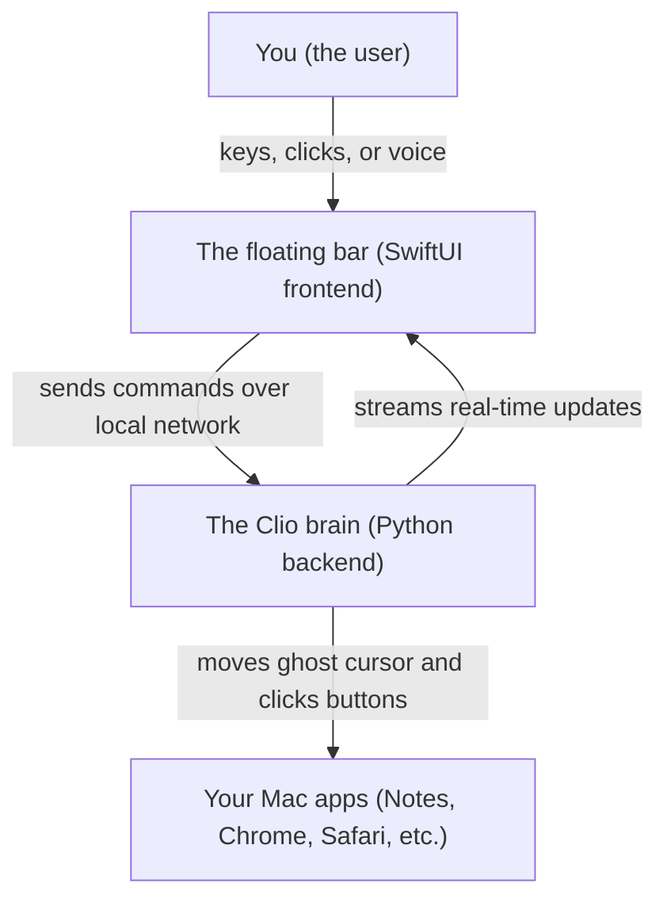
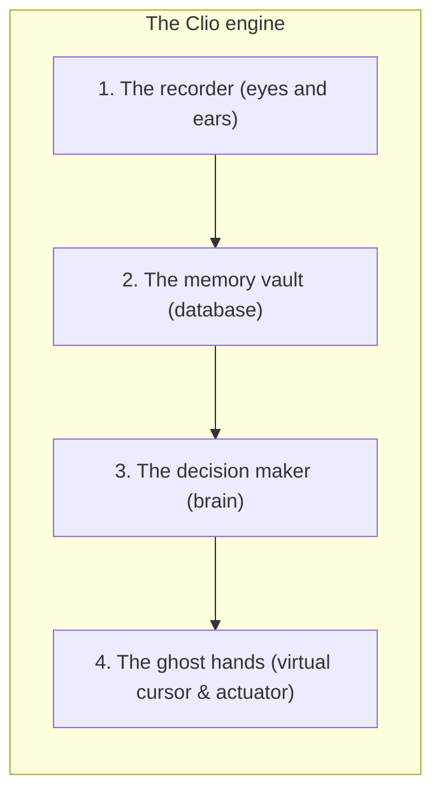

# How Clio works: the simple architecture guide

Imagine you have a personal robot assistant sitting beside your computer. Whenever you have to do some boring, repetitive task—like opening three different websites, copying some text, and organizing your notes—you can tell your robot: *"Watch what I do once, remember it, and next time do it for me."*

That is exactly what **Clio** is. It is a desktop companion for your Mac that watches what you do, turns your clicks and keystrokes into a clean recipe, and repeats the actions whenever you ask—all while showing you what it is doing with its own little purple cursor.

Here is a look under the hood at how Clio is built and how all the parts work together.

---

## The bird's-eye view: two main partners

Clio is split into two main pieces that constantly talk to each other:

1. **The face (the floating bar)**:
   - Written in **Swift and SwiftUI** (the native language for Mac and iPhone apps).
   - Looks like a sleek, dark floating pill at the top of your screen that appears whenever you press `Option + Space`.
   - Has a search box, a voice dictation button, and a record button.
   - It also draws Clio's glowing purple **virtual cursor** on your screen when an automated task is running.

2. **The brain (the core engine)**:
   - Written in **Python**.
   - Runs silently in the background on your Mac.
   - Handles the heavy lifting: watching your screen events, cleaning up messy mouse paths, storing recipes in a database, and controlling Mac apps hands-free.

3. **The walkie-talkie (how they talk)**:
   - The face and the brain talk over a super-fast local connection (`http://127.0.0.1:8765`).
   - When you click a button or type something in the bar, it shoots a message to the Python engine.
   - The Python engine has a live broadcast channel (called a Server-Sent Events stream) that constantly tells the floating bar: *"I'm on step two," "The cursor is at x=500, y=300,"* or *"I just clicked the button!"*

---

## Inside the brain: the four core superpowers

If you opened up the Python backend, you would find four main parts working like an assembly line:

### 1. The recorder (the eyes and ears)
When you click **Record** on the bar, Clio starts paying attention to your mouse and keyboard using macOS system hooks.

If a human just recorded raw mouse coordinates, it would be a total mess: your hand shakes a little bit, you hesitate for five seconds while looking for a button, or you make tiny accidental clicks. 

Clio runs your demonstration through a **four-stage cleanup filter**:
- **Stage 1 (capture)**: Grabs every raw mouse click, key press, and the specific window you were clicking in.
- **Stage 2 (shake remover)**: Throws away tiny mouse jitters (movements under four pixels or quicker than ten milliseconds).
- **Stage 3 (grouper)**: Groups individual letters into whole words and sentences. If you type *"hello"*, it turns five separate key presses into one single *"type the word hello"* instruction.
- **Stage 4 (pause trimmer)**: If you paused for ten seconds trying to remember a password or reading something, Clio trims that long dead silence down to half a second so the playback is brisk and snappy.

### 2. The memory vault (the notebook)
Once a task is cleaned up, it gets saved into an embedded database called **SQLite**. 

Each saved workflow includes:
- A friendly name (e.g., *"Make morning notes"*).
- Triggers (phrases that launch it, like *"morning routine"* or *"start my day"*).
- The list of steps, including target apps and relative positions.

Clio uses a **four-tier search engine** to find your workflows even if you don't remember the exact name:
1. **Exact match**: You typed the exact trigger phrase.
2. **Nickname match**: You used a known synonym or alias.
3. **Keyword search**: A fast search engine looks for words in the title and description.
4. **Fuzzy match**: Even if you make a typo or only remember half the phrase, Clio calculates the similarity and picks the closest match.

### 3. The decision maker (the conversation and intent router)
When you type something into the bar, Clio's dialogue engine figures out what you want:
- Is it a friendly greeting? (e.g., *"Hey Clio!"* &rarr; it says hello back).
- Is it a command to replay what you just showed it? (e.g., *"Do that again"* or *"Run what I just did"* &rarr; it recognizes the reference and picks the latest recorded task).
- Is it a saved recipe? (e.g., *"Format my notes"* &rarr; it pulls the steps from the database).
- Is it something brand new on the fly? (e.g., *"Open YouTube"* or *"Open GitHub"* &rarr; even without a recorded workflow, Clio knows how to launch the app or open the browser tab dynamically).

### 4. The ghost hands (the executor and virtual cursor)
This is where the magic happens. When it's time to run a workflow:

- **The purple virtual cursor**: Instead of violently yanking your actual mouse pointer out of your hand, Clio creates an independent, glowing purple pointer on your screen. It glides with smooth curves toward the button, glows or pulses when it clicks, and shows little status badges so you can see what it's thinking.
- **Background execution**: Clio sends clicks and keystrokes directly to the target application's process. That means it can interact with apps smoothly without interfering with whatever you are doing.
- **Window smarts**: What happens if your window was on the left side of the screen when you recorded, but on the right side when you play it back? Clio calculates coordinates as **percentages of the window** rather than fixed screen pixels. If a button was 80% from the left and 20% from the top of the window, Clio finds the button no matter where the window is moved or resized.

---

## What happens step-by-step: two example journeys

### Journey 1: Teaching Clio a new trick
1. You press `Option + Space` to bring up the bar.
2. You click the **Record** button. The bar starts glowing with a timer.
3. You open your browser, click on a bookmark, and type something in the search bar.
4. You click **Stop & Save**.
5. You name the task *"Check daily news"* with the trigger *"news"*.
6. The Python engine cleans up the raw events, converts the window coordinates, saves the recipe in SQLite, and tells the bar it's ready.

### Journey 2: Asking Clio to run the trick
1. You press `Option + Space`.
2. You type *"news"* and press Enter.
3. The floating bar slides away so your screen stays clean.
4. The Python engine fetches the *"Check daily news"* recipe from its memory vault.
5. The purple virtual cursor glides across your screen to the browser, clicks the bookmark, and fills in the search box.
6. When finished, the virtual cursor quietly fades away, leaving your desktop right where you want it.

---

## Safety features: keeping the robot under control

Nobody wants automation that goes out of control. Clio includes built-in guardrails:
- **Emergency stop**: You can cancel execution at any time by pressing escape, clicking cancel, or using the hide commands.
- **Fail-safe corner checks**: If the cursor ever behaves unexpectedly, safety routines instantly release simulated keys and stop actions.
- **Non-destructive actions**: Workflows are saved with version histories in the database, meaning you can inspect, edit, or delete them whenever you want.

---

## Quick summary cheat-sheet

| Component | What technology it uses | What it does in simple terms |
| :--- | :--- | :--- |
| **Floating bar** | Swift / SwiftUI | The user interface you see and talk to on macOS |
| **Engine server** | Python (`http.server` & `threading`) | The local conductor connecting the UI to the background brain |
| **Demonstration recorder** | Python + macOS event tap | Watches your clicks and keystrokes, removing jitters and long pauses |
| **Task memory** | SQLite + full-text search (FTS5) | The vault that remembers recipes and finds them even with typos |
| **Intent synthesizer** | Python regex & pattern matching | Understands what you mean (greetings, saved tasks, or web actions) |
| **Autonomous executor** | Python closed-loop runner | Steps through the recipe with retries, waits, and coordinate adjustments |
| **Virtual cursor** | SwiftUI overlay + native event dispatch | The friendly glowing purple cursor that executes clicks hands-free |
