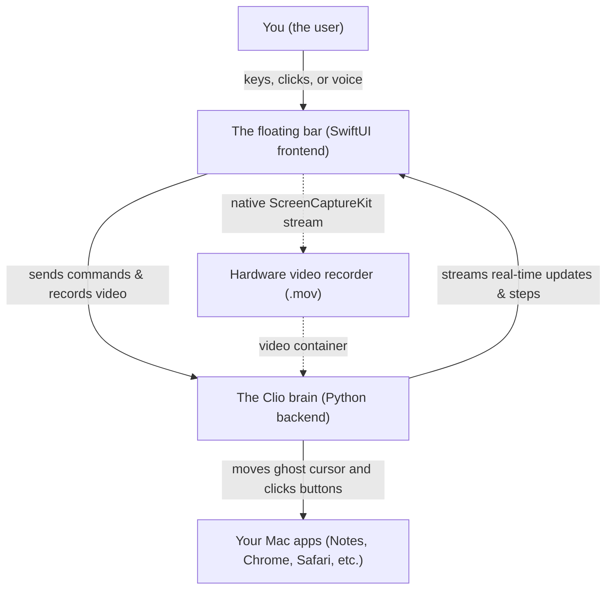
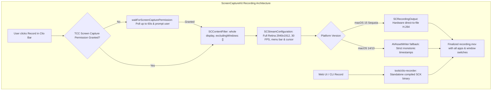
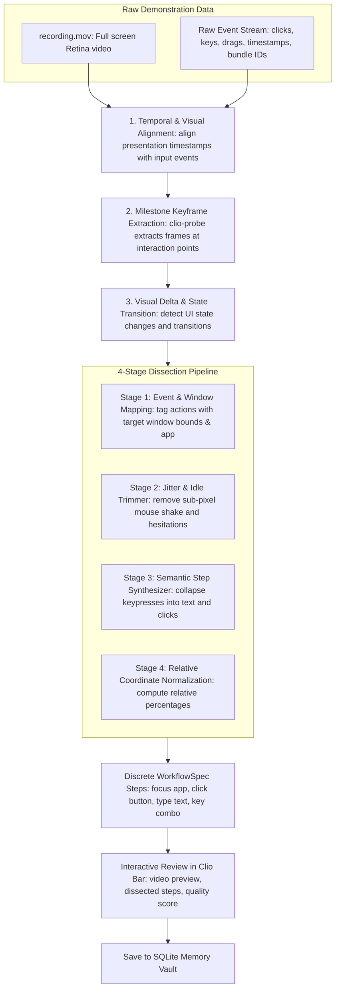
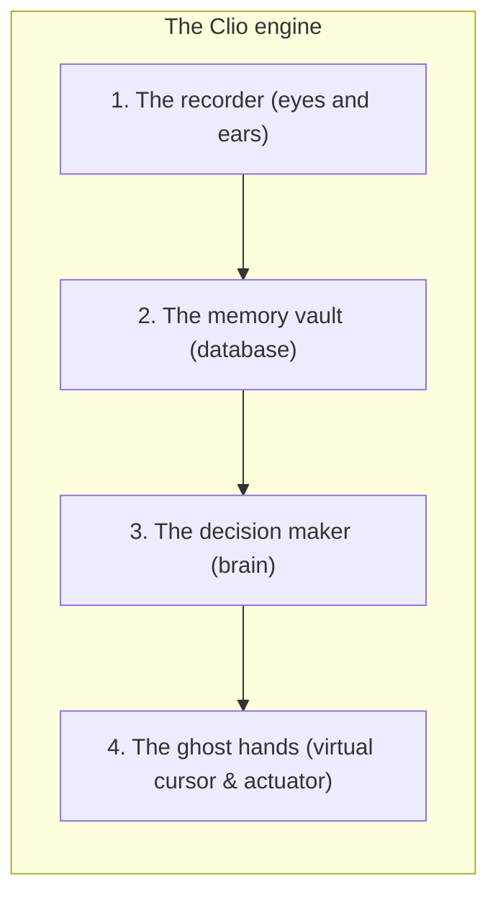

# How Clio works: the simple architecture guide

Imagine you have a personal robot assistant sitting beside your computer. Whenever you have to do some boring, repetitive task—like opening three different websites, copying some text, and organizing your notes—you can tell your robot: *"Watch what I do once, remember it, and next time do it for me."*

That is exactly what **Clio** is. It is a desktop companion for your Mac that watches what you do, turns your clicks and keystrokes into a clean recipe, and repeats the actions whenever you ask—all while showing you what it is doing with its own little purple cursor.

Here is a look under the hood at how Clio is built and how all the parts work together.

---

## The bird's-eye view: two main partners

Clio is split into two main pieces that constantly talk to each other:



1. **The face (the floating bar)**:
   - Written in **Swift and SwiftUI** (the native language for Mac and iPhone apps).
   - Looks like a sleek, dark floating pill at the top of your screen that appears whenever you press `Option + Space`.
   - Has a search box, a voice dictation button, and a record button.
   - Houses the native **ScreenCaptureKit** hardware recording pipeline for high-definition full-screen capture.
   - Draws Clio's glowing purple **virtual cursor** on your screen when an automated task is running.

2. **The brain (the core engine)**:
   - Written in **Python**.
   - Runs silently in the background on your Mac.
   - Handles the heavy lifting: watching your screen events, dissecting video recordings into discrete steps, cleaning up messy mouse paths, storing recipes in a database, and controlling Mac apps hands-free.

3. **The walkie-talkie (how they talk)**:
   - The face and the brain talk over a super-fast local connection (`http://127.0.0.1:8765`).
   - When you click a button or type something in the bar, it shoots a message to the Python engine.
   - The Python engine has a live broadcast channel (called a Server-Sent Events stream) that constantly tells the floating bar: *"I'm on step two," "The cursor is at x=500, y=300,"* or *"I just clicked the button!"*

---

## The screen recording system: full-screen, multi-window capture

In modern macOS (especially macOS 14 Sonoma and macOS 15 Sequoia), Apple introduced strict security safeguards around screen capture. If a background process tries to take screenshots or spawn CLI utilities like `screencapture -v` without direct user authorization, macOS WindowServer strips out all application windows, returning only an empty desktop wallpaper.

To solve this, Clio uses a dual-engine native recording architecture built on Apple's **ScreenCaptureKit**:



### 1. Canonical whole-display capture
- Uses `SCContentFilter(display: display, excludingWindows: [])` with `includeMenuBar = true`.
- Captures the primary display at full native Retina resolution (e.g. 2940×1912 pixels at ~30 FPS).
- Unlike single-window capture filters, the whole-display filter captures **everything the user sees**:
  - All open application windows across spaces.
  - Active **window switching** (e.g. moving between Chrome, Terminal, and Notes).
  - Newly opening or closing applications during the demonstration.
  - System context menus, dropdowns, and the macOS Dock and menu bar.

### 2. Async TCC permission polling
- `CGRequestScreenCaptureAccess()` is a fire-and-forget API that displays macOS System Settings but returns immediately without blocking.
- Clio's `waitForScreenCapturePermission` asynchronously polls `CGPreflightScreenCaptureAccess()` every 500ms for up to 60 seconds.
- Only once permission is confirmed does the recording stream start. If access is denied, Clio resets the recording UI state and opens System Settings directly to **Privacy & Security > Screen Recording**, avoiding silent error `-3801`.

### 3. Dual-engine recording: UI app & standalone CLI
- **Primary engine (`SwiftScreenRecorder`)**: Runs inside the main authorized `Clio.app` process. Pre-registers the video path (`swift_video_path`) with the Python server via `/api/record/start`, ensuring Python does not launch conflicting recorders.
- **CLI helper (`tools/clio-recorder`)**: A standalone compiled Swift binary packaged directly in `Clio.app/Contents/MacOS/clio-recorder` and `bin/clio-recorder`. Used when recording is initiated via the Web UI, API, or automated test suites.

### 4. Verification & health probing (`clio-probe`)
- When recording finishes, Clio verifies container validity using `tools/clio-probe.swift`.
- Probes resolution, duration, nominal frame rate, and confirms that the QuickTime container (`moov` atom and `mdat` video payload) is properly closed and readable before handing off to the dissection pipeline.

---

## Dissecting the video recording into small steps

Once the user clicks **Stop & Save**, the next crucial phase of the flow begins: **video and event dissection**. 

A continuous video recording alone is just a movie—it cannot be automated until Clio breaks it down into small, structured, repeatable steps:



### Step-by-step dissection breakdown

#### 1. Temporal & event alignment
- The demonstration capture pipeline logs every mouse click, mouse movement, key press, and window focus event with millisecond-precision timestamps (`ev.timestamp`).
- The recording video file has Presentation Time Stamps (`PTS`) embedded in its video frames.
- Clio aligns each input event with the corresponding video frame timestamp:
  $$\Delta t = |t_{\text{event}} - t_{\text{video}}|$$
- This guarantees that every simulated action has an exact visual snapshot of the screen right before the action was taken.

#### 2. Milestone keyframe extraction (`clio-probe`)
- Instead of keeping thousands of video frames in memory, Clio samples **milestone keyframes** at critical interaction moments:
  - **Pre-interaction frame**: The state of the screen 100ms before a click (what the button looked like before being pressed).
  - **Interaction impact frame**: The exact frame where the mouse clicked or text was submitted.
  - **Post-interaction frame**: The resulting screen state 300ms–500ms after the action (verifying the window opened, menu dropped down, or page updated).
- Frames are extracted using macOS hardware decoders (`AVAssetImageGenerator`) and saved as optimized JPEGs in `recordings/<session_id>/frames/`.

#### 3. Visual delta & state change detection
- Clio compares the pre-action and post-action keyframes to measure the visual difference (delta).
- If a click produces a significant visual change in a bounded region (e.g., a menu appearing or a modal popping up), Clio records this visual boundary as a visual anchor.
- If a click produces zero visual change, Clio evaluates whether the action was an intentional wait, a non-responsive click, or background noise.

#### 4. The 4-stage dissection pipeline
The raw event log and keyframes are processed through a structured 4-stage cleanup filter:
- **Client-Buffered Event Delivery**: To eliminate timing race conditions during ScreenCaptureKit session spin-up, the native Swift client buffers all mouse clicks, drags, keystrokes, and window movements locally in memory (`recordedEvents`). At stop time, the complete stream is delivered atomically via `/api/record/stop`, guaranteeing zero dropped events.
- **Stage 1 (Window & App Mapping)**: Binds every event to its target macOS application bundle ID (e.g. `com.google.Chrome`, `com.apple.Notes`) and current window bounds, filtering out events targeting Clio's own UI bar.
- **Stage 2 (Jitter & Pause Trimming)**: Throws away mouse movements under 4 pixels, dead time longer than 500ms (trimmed down), and unintentional double-clicks.
- **Stage 3 (Semantic Step Grouping)**: Converts low-level I/O events into high-level human actions:
  - Individual character keystrokes $\rightarrow$ single `type_text` action (e.g. typing *"hello"* becomes one step).
  - Modifier + key combinations $\rightarrow$ `key_combo` action (e.g. `Command + S` for save).
  - Mouse down + drag + mouse up $\rightarrow$ single `drag` action.
- **Stage 4 (Relative Coordinate Normalization)**: Converts absolute screen pixel coordinates into percentage offsets relative to the active window:
  $$\text{rel\_x} = \frac{x_{\text{click}} - x_{\text{window}}}{\text{width}_{\text{window}}}, \quad \text{rel\_y} = \frac{y_{\text{click}} - y_{\text{window}}}{\text{height}_{\text{window}}}$$
  This ensures that when Clio repeats the steps later, the click hits the exact button even if the user moved or resized the window.
- **Deterministic Non-AI Fallback**: If an event stream is quiet or restricted by accessibility permissions, the pipeline synthesizes deterministic non-AI steps derived from window tracking telemetry (`_tracked_windows`, `_window_movements`), frontmost target application, and keyframe snapshots so that workflows are never empty stubs.

#### 5. Output: the structured `WorkflowSpec`
The output of dissection is a clean, structured `WorkflowSpec` consisting of small, discrete `WorkflowStep` objects:
```json
{
  "name": "Check Daily News",
  "triggers": { "canonical": "news", "aliases": ["check daily news", "read news"] },
  "steps": [
    {
      "order": 1,
      "action": "focus_app",
      "description": "Focus Safari",
      "target": { "bundle_id": "com.apple.Safari" }
    },
    {
      "order": 2,
      "action": "click",
      "description": "Click URL address bar",
      "target": { "rel_x": 0.45, "rel_y": 0.08, "bundle_id": "com.apple.Safari" },
      "keyframe": "frames/frame_0001_click.jpg"
    },
    {
      "order": 3,
      "action": "type_text",
      "description": "Type website URL",
      "parameters": { "text": "https://news.ycombinator.com" }
    },
    {
      "order": 4,
      "action": "key_combo",
      "description": "Submit navigation",
      "parameters": { "keys": ["Return"] }
    }
  ]
}
```

#### 6. Step Inspection in the Clio Bar (Zero Cursor Actions)
When a user searches or queries an action in the Clio Bar, the bar presents an interactive inspection card showing the ordered dissected steps (`1. Focus Safari`, `2. Click URL bar`, etc.). Crucially, querying or viewing the action does **not** conduct actions with the Clio virtual cursor or take unwanted automated actions; it presents the dissected steps for review, giving the user full visibility and control over their recorded workflows.

---

## Inside the brain: the four core superpowers

If you opened up the Python backend, you would find four main parts working like an assembly line:



### 1. The recorder (the eyes and ears)
When you click **Record** on the bar, Clio starts paying attention to your screen via ScreenCaptureKit and your mouse/keyboard using macOS system hooks. It captures high-resolution video and raw event timelines, automatically feeding them into the dissection pipeline upon completion.

### 2. The memory vault (the notebook)
Once a task is dissected into small steps, it gets saved into an embedded database called **SQLite**. 

Each saved workflow includes:
- A friendly name (e.g., *"Make morning notes"*).
- Triggers (phrases that launch it, like *"morning routine"* or *"start my day"*).
- The list of steps, including target apps, relative positions, and visual reference frames.
- A recording quality score (0–100) and grade (EXCELLENT, GOOD, ACCEPTABLE).

Clio uses a **four-tier search engine** to find your workflows even if you don't remember the exact name:
1. **Exact match**: You typed the exact trigger phrase.
2. **Nickname match**: You used a known synonym or alias.
3. **Keyword search**: A fast search engine looks for words in the title and description.
4. **Fuzzy match**: Even if you make a typo or only remember half the phrase, Clio calculates the similarity and picks the closest match.

### 3. The decision maker (the conversation and intent router)
When you type something into the bar, Clio's dialogue engine figures out what you want:
- Is it a friendly greeting? (e.g., *"Hey Clio!"* &rarr; it says hello back).
- Is it a command to replay what you just showed it? (e.g., *"Do that again"* or *"Run what I just did"* &rarr; it recognizes the reference and picks the latest recorded task).
- Is it a saved recipe? (e.g., *"Format my notes"* &rarr; it pulls the steps from the database).
- Is it something brand new on the fly? (e.g., *"Open YouTube"* or *"Open GitHub"* &rarr; even without a recorded workflow, Clio knows how to launch the app or open the browser tab dynamically).

### 4. The ghost hands (the executor and virtual cursor)
When it's time to run a workflow:
- **The purple virtual cursor**: Instead of violently yanking your actual mouse pointer out of your hand, Clio creates an independent, glowing purple pointer on your screen. It glides with smooth curves toward the button, glows or pulses when it clicks, and shows little status badges so you can see what it's thinking.
- **Background execution**: Clio sends clicks and keystrokes directly to the target application's process. That means it can interact with apps smoothly without interfering with whatever you are doing.
- **Window smarts**: What happens if your window was on the left side of the screen when you recorded, but on the right side when you play it back? Clio calculates coordinates as **percentages of the window** rather than fixed screen pixels. If a button was 80% from the left and 20% from the top of the window, Clio finds the button no matter where the window is moved or resized.

---

## What happens step-by-step: two example journeys

### Journey 1: Teaching Clio a new trick (record & dissect)
1. You press `Option + Space` to bring up the bar.
2. You click the **Record** button. The bar starts glowing with a timer, and `SwiftScreenRecorder` begins native whole-display recording.
3. You open Safari, switch to your Terminal, type a command, and click a button in Notes.
4. You click **Stop & Save**.
5. Clio finalizes the video container and passes the video + event stream through the **dissection pipeline**:
   - Aligns keystrokes and clicks to milestone video keyframes.
   - Trims pauses and collapses raw keystrokes into words.
   - Computes relative coordinates for each window.
6. The floating bar opens the **Review & Save** modal:
   - Displays the video preview with playback controls.
   - Displays the dissected step list with quality rating.
7. You name the task *"Morning Dev Routine"* with trigger *"morning"*, and click Save.

### Journey 2: Asking Clio to run the trick
1. You press `Option + Space`.
2. You type *"morning"* and press Enter.
3. The floating bar slides away so your screen stays clean.
4. The Python engine fetches the *"Morning Dev Routine"* recipe from its memory vault.
5. The purple virtual cursor glides across your screen to Safari, switches to Terminal, and clicks the target in Notes.
6. When finished, the virtual cursor quietly fades away, leaving your desktop right where you want it.

---

## Safety features: keeping the robot under control

Clio includes built-in guardrails to ensure automation is safe and predictable:
- **Emergency stop**: You can cancel execution at any time by pressing escape, clicking cancel, or using the hide commands.
- **Fail-safe corner checks**: If the cursor ever behaves unexpectedly, safety routines instantly release simulated keys and stop actions.
- **Non-destructive actions**: Workflows are saved with version histories in the database, meaning you can inspect, edit, or delete them whenever you want.
- **Quality verification**: Every demonstration is checked for container integrity, dropped frames, and coordinate boundaries before it can be executed.

---

## Quick summary cheat-sheet

| Component | What technology it uses | What it does in simple terms |
| :--- | :--- | :--- |
| **Floating bar** | Swift / SwiftUI | The user interface you see and talk to on macOS |
| **Screen recorder** | Apple ScreenCaptureKit (`SCRecordingOutput`) | Captures full display, active apps, window switches, and dock at native Retina resolution |
| **Standalone recorder** | Swift CLI (`tools/clio-recorder.swift`) | Headless recorder binary for web UI & API-driven demonstrations |
| **Integrity probe** | AVFoundation (`tools/clio-probe.swift`) | Verifies video duration, nominal FPS, and extracts milestone keyframes |
| **Dissection pipeline** | Python (`capture.py` & `models.py`) | Dissects video & event stream into discrete, normalized `WorkflowStep` recipes |
| **Engine server** | Python (`http.server` & `threading`) | The local conductor connecting the UI to the background brain |
| **Task memory** | SQLite + full-text search (FTS5) | The vault that remembers recipes and finds them even with typos |
| **Intent synthesizer** | Python regex & pattern matching | Understands what you mean (greetings, saved tasks, or web actions) |
| **Autonomous executor** | Python closed-loop runner | Steps through the recipe with retries, waits, and coordinate adjustments |
| **Virtual cursor** | SwiftUI overlay + native event dispatch | The friendly glowing purple cursor that executes clicks hands-free |
